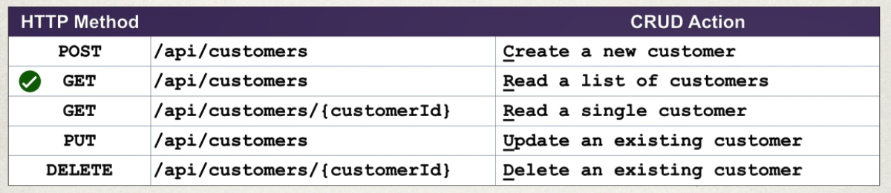

<h1>REST CRUD Application</h1>
<ol>
	<h2>App Configuration</h2>
	<li>See the properties file in the resources and Config file in config package</li>
	<li>Simple create entity, dao and services for documentation see <strong>Spirng/HibernateSpringWebApp</strong></li>
</ol>

<ol>
	<h5>Exception Handling</h5>
	<li>See Spring/RestFul1</li>
</ol>

<h2>Rest API Best Practice</h2>

<ol>
	<h2>Adding a Customer</h2>
	<li>We Use @BodyRequest in the add Parameter to convert the JSON data to POJO</li>
</ol>

<ol>
	<h5>Notes: </h5>
	<li>Use <strong>@EnableTransactionManagement</strong> to enable HIBERNATE transaction in Config class</li>
</ol>