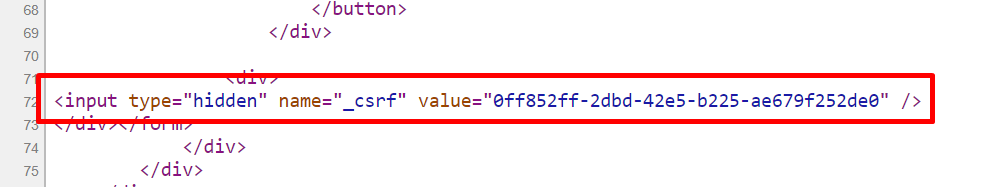

<h2 align="center">Cross Site Request Forgery</h2>
<h6>For configuration check <strong>SpringSecurity2_CustomLoginForm</strong></h6>
<ol>
	<li>Sessions on Token</li>
	<li>Spring create a token in the JSP page and when we proceed for any request then for this session this token will be validated</li>
	<li>So, that application can verify that this is the actual user who is logged in</li>
</ol>
<ol>
	<li>So, when we use form:form tag then spring automatically generate tokens</li>
	<li></img></li>
	<li>We can generate _csrf token without using form:form tag </li>
	<li>input type=hidden name=${_csrf.parameterName} value=${_csrf.token}</li>
</ol>