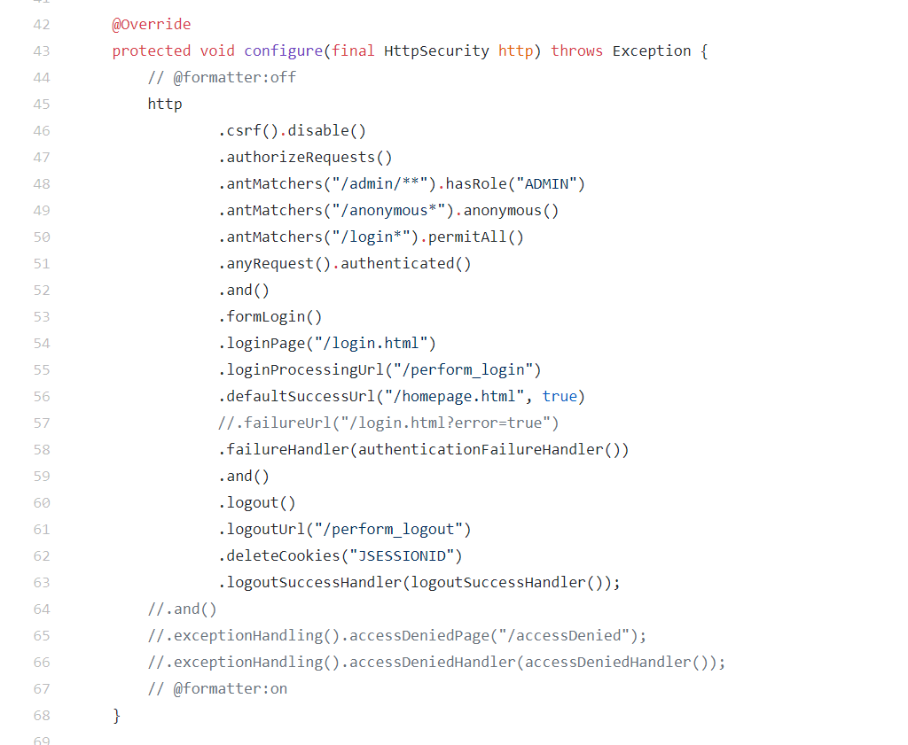
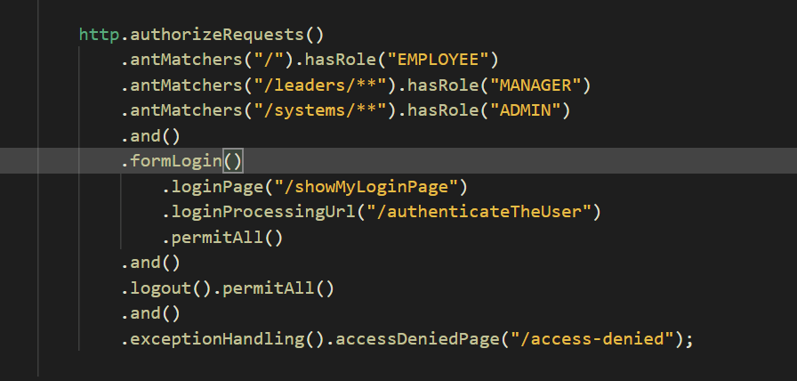

<h1>Role Based Access</h1>
<ol>
	<li>For simple Constructing Custom Login see <strong>SpringSecurity4_RestrictAccess</strong></li>
	<li>So, we can check name of user and its role by tag sec:authentication property=principal.username</li>
	<li>and role by sec:authentication property=principal.authorities</li>
	<ol>
		About dependencies:
		<li>Spring Security Tag Lib from maven</li>
		<li>And for security tag, import url in the top of jsp file</li>
	</ol>	
</ol>

<ol>
	<h3>Adding Denied Page</h3>
	<li>In Security After calling and method, call exceptionHandling method and then chain it with accessDeniedPage()</li>
	
</ol>

<ol>
	<h4>Display Content on Role</h4>
	<li>Simply add the content in sec:authorize hasRole="(ROLE)"</li>
</ol>

<ol>
	Problems:
	<li>For Security Http Config: I have always recieved errors: </li>
	<li><strong>/SpringSecurity4_RestrictAccess/src/main/java/com/ubaid/app/security/Config.java</strong> for standard http config</li>
	<li>See the reference: </li>
	<li>Here is an instructor code: </li>
</ol>